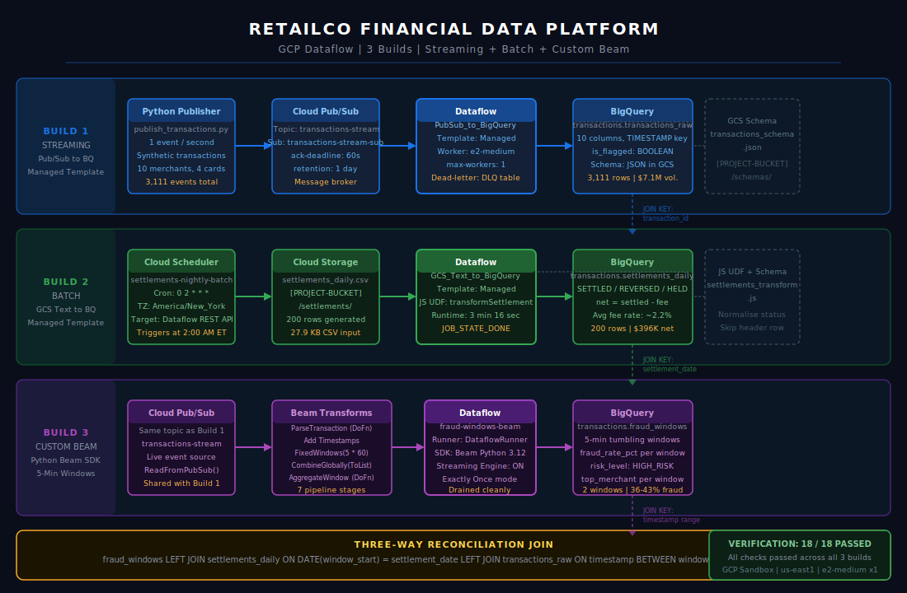
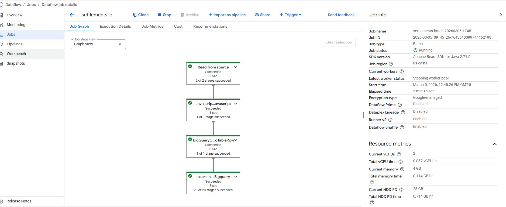
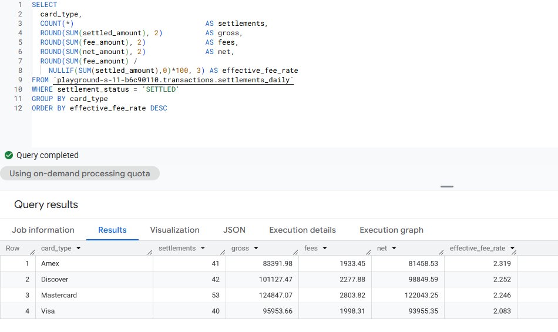
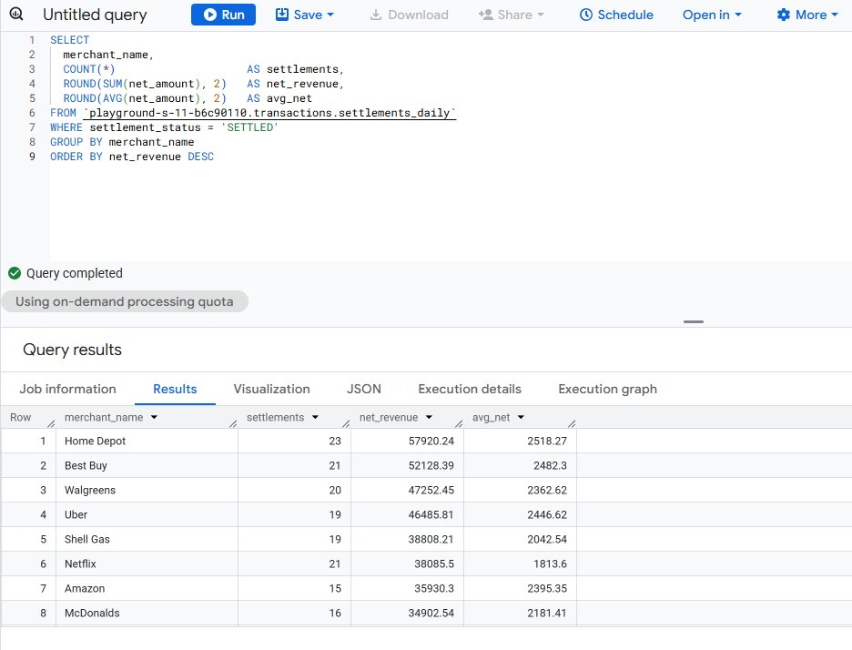
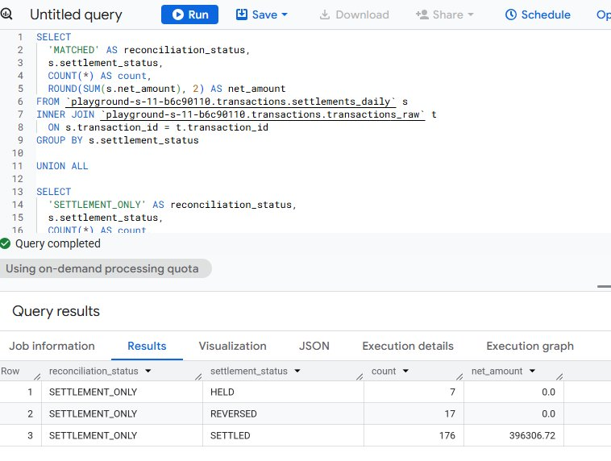
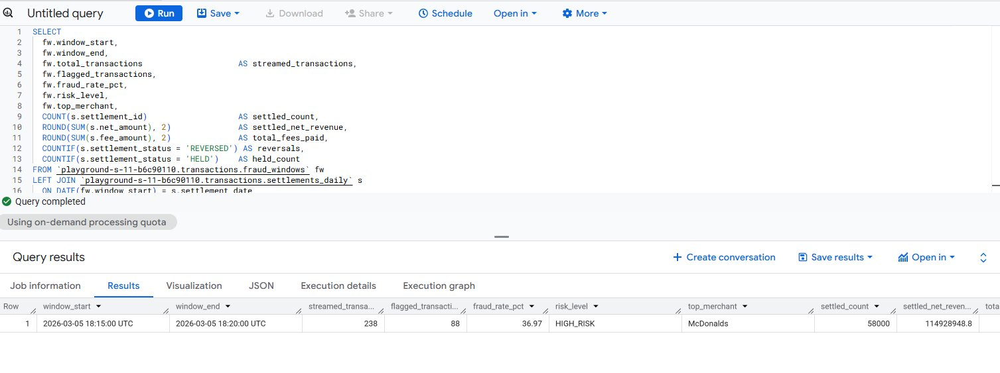

# RetailCo GCP Dataflow Platform


A three-build financial data platform on Google Cloud Platform demonstrating real-time streaming ingestion, scheduled batch loading, and custom windowed fraud detection using Apache Beam.

> **Synthetic Data Disclaimer:** All data in this project is fully synthetic. Transactions, merchants, amounts, settlement records, and fraud flags were generated programmatically for demonstration purposes. All figures are non-production and do not represent real financial activity.

---

## Architecture



Three pipelines feed a single BigQuery dataset and are joined in a final reconciliation query.

| Build | Pattern | Template |
|---|---|---|
| Build 1 | Pub/Sub to BigQuery streaming | Managed Dataflow template |
| Build 2 | GCS CSV to BigQuery batch load | Managed Dataflow template with JavaScript UDF |
| Build 3 | Pub/Sub windowed fraud detection | Custom Apache Beam Python pipeline |

---

## Verified Results

All metrics below are from synthetic data generated during the project run.

### Build 1: Streaming

| Metric | Value |
|---|---|
| Total transactions captured | 3,111 |
| Total volume | $7,097,837.92 |
| Flagged transactions | 1,181 |
| Dead-letter errors | 0 |
| Merchants | 10 |
| Card types | 4 |

### Build 2: Batch

| Metric | Value |
|---|---|
| Settlement records loaded | 200 |
| SETTLED | 176 records |
| REVERSED | 17 records |
| HELD | 7 records |
| Net revenue loaded | $396,306.72 |
| Job runtime | 3 minutes 16 seconds |
| Data quality checks | 3 of 3 passed |

**Batch DAG completed (4 stages, all green):**



**Fee analysis by card network:**



**Merchant net revenue breakdown:**



**Streaming vs batch reconciliation query:**



### Build 3: Custom Beam

| Metric | Value |
|---|---|
| Fraud windows captured | 2 |
| Window 1 fraud rate | 36.97% HIGH_RISK, top merchant McDonalds |
| Window 2 fraud rate | 43.78% HIGH_RISK, top merchant Uber |
| Window duration | Exactly 5 minutes each |
| Pipeline stages | 7 custom transforms |

**Three-way join across all three builds:**



### Verification

**18 of 18 automated checks passed** across all three builds covering row counts, data quality, UDF correctness, fraud detection logic, and the three-way reconciliation join.

---

## Project Structure

```
retailco-gcp-dataflow/
├── streaming/
│   └── publish_transactions.py       Synthetic transaction publisher
├── batch/
│   ├── generate_settlements.py       Daily settlements CSV generator
│   ├── settlements_schema.json       BigQuery schema for Dataflow template
│   └── settlements_transform.js      JavaScript UDF: normalize and validate rows
├── beam/
│   └── fraud_windows_pipeline.py     Custom Apache Beam pipeline with 5-min windows
├── sql/
│   ├── settlement_summary.sql        Settlement breakdown by status
│   ├── fee_analysis.sql              Card network effective fee rates
│   ├── reconciliation.sql            Streaming vs batch reconciliation join
│   └── three_way_join.sql            Three-table join across all three builds
├── screenshots/
│   ├── build2_batch_dag_running.png
│   ├── build2_batch_dag_completed.png
│   ├── build2_fee_analysis_by_card_type.png
│   ├── build2_merchant_net_revenue.png
│   ├── build2_reconciliation_query.png
│   ├── build2_cloud_scheduler.png
│   ├── build3_beam_dag_top.png
│   ├── build3_beam_dag_bottom.png
│   ├── build3_write_to_bigquery_stage.png
│   ├── build3_three_way_join_results.png
│   └── build3_three_way_join_full_row.png
└── docs/
    ├── RetailCo_Architecture.svg     Full architecture diagram
    └── RetailCo_QA_Explanation.docx  Technical Q&A and design decisions
```

---

## Documentation

| Document | Description |
|---|---|
| [Architecture Diagram](docs/RetailCo_Architecture.svg) | Three-build pipeline architecture with component details |
| [Q&A and Technical Explanation](docs/RetailCo_QA_Explanation.docx) | 15 interview-ready Q&A covering design decisions, debugging, and production considerations |

---

## Tech Stack

- Google Cloud Dataflow
- Google Cloud Pub/Sub
- Google BigQuery
- Google Cloud Storage
- Apache Beam Python SDK 3.12
- Cloud Scheduler
- Python 3

---

## Infrastructure Configuration

| Setting | Value |
|---|---|
| Region | us-east1 |
| Worker type | e2-medium |
| Max workers | 1 |
| Streaming engine | Enabled |
| Job mode | Exactly once |

---

## The Reconciliation Query

The three-way join across all three builds:

```sql
SELECT
  fw.window_start,
  fw.window_end,
  fw.total_transactions        AS streamed_transactions,
  fw.flagged_transactions,
  fw.fraud_rate_pct,
  fw.risk_level,
  fw.top_merchant,
  COUNT(s.settlement_id)       AS settled_count,
  ROUND(SUM(s.net_amount), 2)  AS settled_net_revenue,
  ROUND(SUM(s.fee_amount), 2)  AS total_fees_paid,
  COUNTIF(s.settlement_status = 'REVERSED') AS reversals,
  COUNTIF(s.settlement_status = 'HELD')     AS held_count
FROM `[PROJECT-ID].transactions.fraud_windows` fw
LEFT JOIN `[PROJECT-ID].transactions.settlements_daily` s
  ON DATE(fw.window_start) = s.settlement_date
LEFT JOIN `[PROJECT-ID].transactions.transactions_raw` t
  ON t.timestamp BETWEEN fw.window_start AND fw.window_end
GROUP BY
  fw.window_start, fw.window_end,
  fw.total_transactions, fw.flagged_transactions,
  fw.fraud_rate_pct, fw.risk_level, fw.top_merchant
ORDER BY fw.window_start DESC
```
